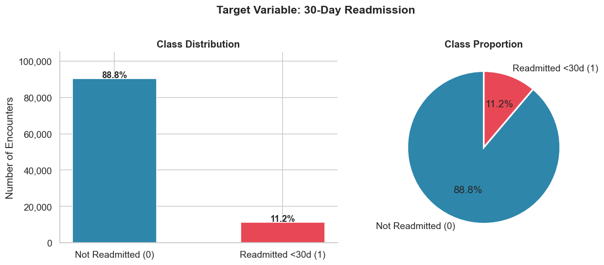
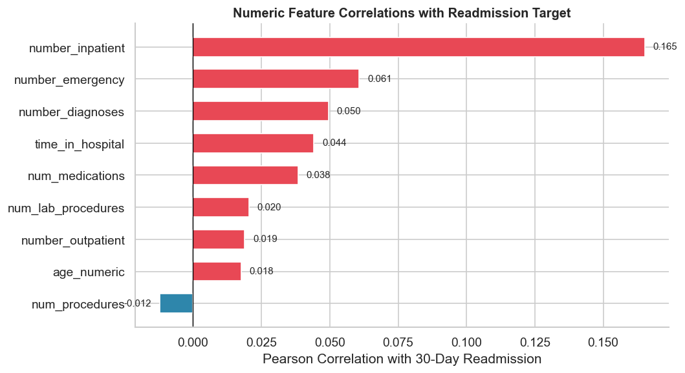
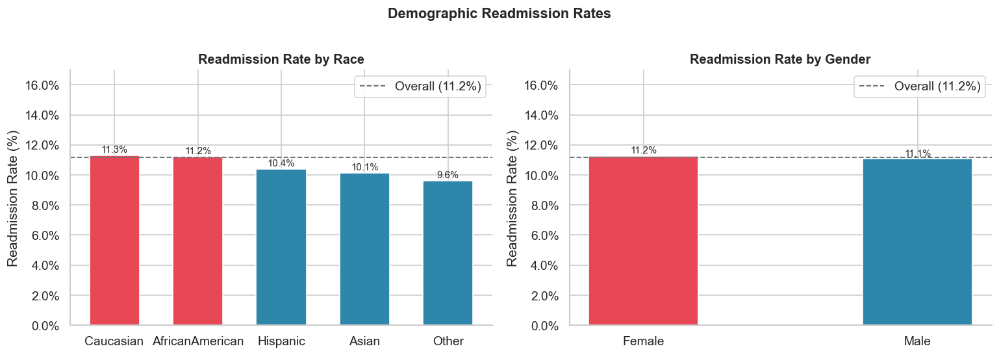
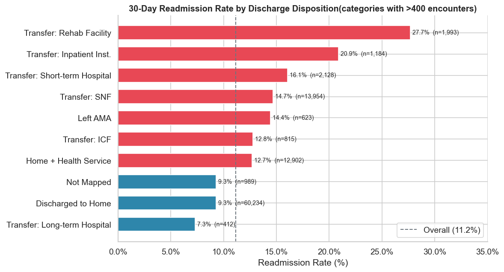

# Predicting 30-Day Hospital Readmission in Diabetic Patients

End-to-end healthcare analytics capstone project using the Diabetes 130-US Hospitals dataset to identify patients at high risk of readmission within 30 days.

## Live Project
- Web App: [https://healthcare-readmission-analytics.onrender.com](https://healthcare-readmission-analytics.onrender.com)
- Repository: [https://github.com/Souravv2412/healthcare-readmission-analytics](https://github.com/Souravv2412/healthcare-readmission-analytics)

## Why This Project Matters
- Hospital readmissions increase clinical risk and cost.
- The dataset is highly imbalanced (~11% positive class), so model design and evaluation must prioritize `Recall`, `PR-AUC`, and `ROC-AUC` over raw accuracy.
- This project combines data audit, cleaning, EDA, hypothesis testing, model development, and a Flask decision-support app.

## What I Built
- Full analytics workflow from raw data to deployable web app.
- EDA focused on clinically meaningful risk drivers.
- Comparative ML modeling (including gradient boosting models) for risk detection.
- Flask-based interactive dashboard + risk predictor.

## Key Results (Quick Recruiter View)
- Strongest signal: prior inpatient utilization.
- Best-performing deployment candidates: LightGBM and XGBoost.
- Practical focus: maximize recall for high-risk patients while monitoring false positives.

## Project Workflow
Detailed execution flow is documented in:
- [PROJECT_WORKFLOW.md](PROJECT_WORKFLOW.md)

## Visual Highlights
### EDA and Main Findings





More visuals:
- `images/eda/` (all extracted EDA charts)
- `images/main_findings/` (curated key findings)

## Repository Structure
```text
Healthcare_project/
├── Dataset/
├── Notebook/
├── healthcare_app/
├── src/
├── images/
├── Documents/
├── PROJECT_WORKFLOW.md
└── README.md
```

## Run the Flask App
```bash
cd healthcare_app
python -m venv .venv
.venv\Scripts\activate
pip install -r requirements.txt
python app.py
```

Open: `http://127.0.0.1:5000`

## Team
- [Souravdeep Singh](https://github.com/Souravv2412)
- [Aum Gajjar](https://github.com/Aum-gajjar)
- [Priyanka Sharma](https://github.com/Priyanka-Sharma20)
- [Sakshi Thakur](https://github.com/sakshiithakur26)

