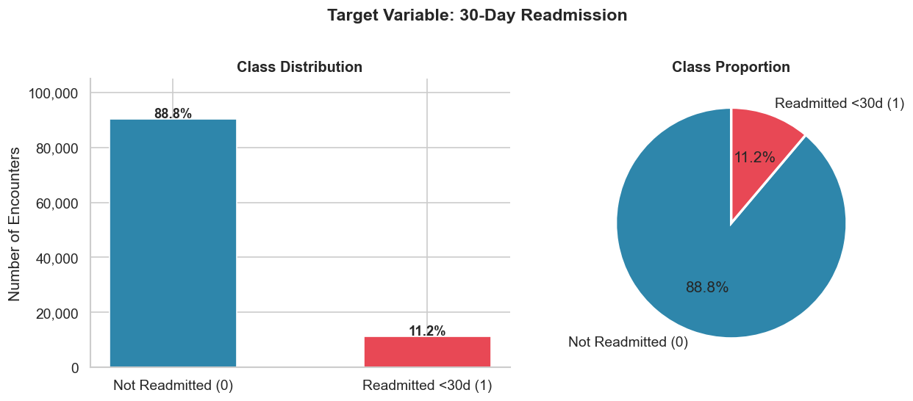
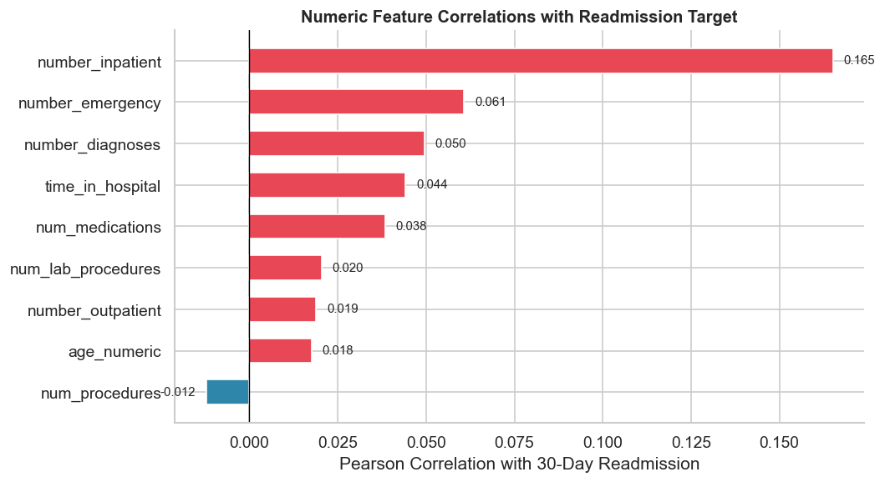
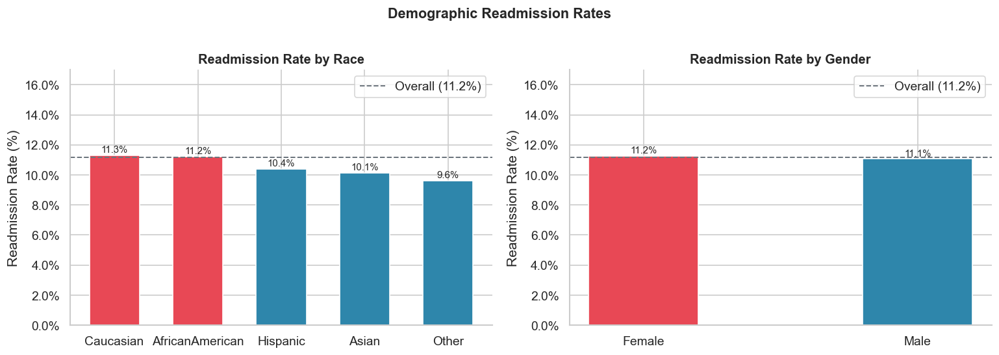
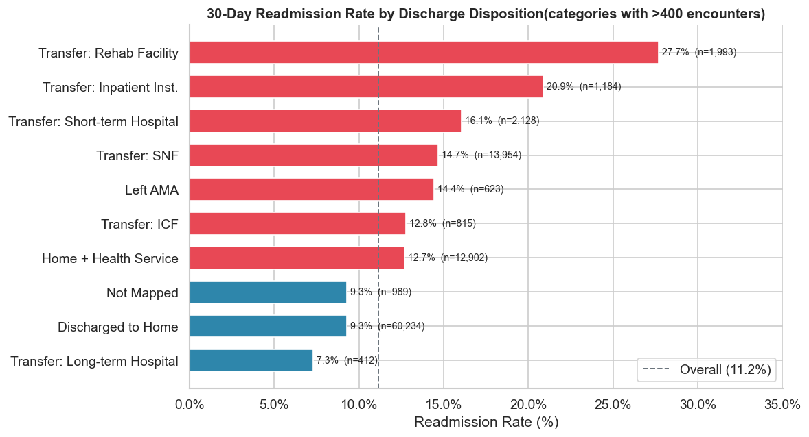

# Predicting 30-Day Hospital Readmission in Diabetic Patients

End-to-end healthcare analytics capstone project using the Diabetes 130-US Hospitals dataset to identify patients at high risk of readmission within 30 days.

## Live Project
- Web App: [https://healthcare-readmission-analytics.onrender.com](https://healthcare-readmission-analytics.onrender.com)
- Repository: [https://github.com/Souravv2412/healthcare-readmission-analytics](https://github.com/Souravv2412/healthcare-readmission-analytics)

## Headline Metrics (Recall/AUC First)
- **XGBoost**: Recall **0.5466**, ROC-AUC **0.6804**, PR-AUC **0.2403**
- **LightGBM**: Recall **0.5435**, ROC-AUC **0.6745**, PR-AUC **0.2403**
- Positive class prevalence: ~**11.2%** (`<30` readmission), so Recall/PR-AUC/ROC-AUC were prioritized over plain Accuracy.

## Why This Project Matters
- Hospital readmissions increase clinical risk and cost.
- The dataset is highly imbalanced (~11% positive class), so model design and evaluation must prioritize `Recall`, `PR-AUC`, and `ROC-AUC` over raw accuracy.
- This project combines data audit, cleaning, EDA, hypothesis testing, model development, and a Flask decision-support app.

## My Contribution
- Performed **EDA** and identified the strongest readmission drivers.
- Completed **data cleaning** and preprocessing pipeline for modeling.
- Built the **Flask web app** (multi-page analytics + predictor).
- Implemented the **readmission predictor** workflow in the app.
- Validated model performance with **Recall / ROC-AUC / PR-AUC** focus.
- Addressed **class imbalance** in both evaluation strategy and model setup.

## Key Results (Quick Recruiter View)
- Strongest signal: prior inpatient utilization.
- Best-performing deployment candidates: LightGBM and XGBoost.
- Practical focus: maximize recall for high-risk patients while monitoring false positives.

## Project Workflow
Detailed execution flow is documented in:
- [PROJECT_WORKFLOW.md](PROJECT_WORKFLOW.md)

## EDA and Main Findings





## Web App Pages and Screenshots
If the live app is temporarily unavailable, use these README screenshots and the findings images above as reference.

### 1) Home (`/`)


### 2) Data Audit (`/audit`)


### 3) Data Cleaning (`/cleaning`)


### 4) EDA (`/eda`)


### 5) Hypothesis Testing (`/hypothesis`)


### 6) Model Comparison (`/models`)


### 7) Predictor (`/predict`)


### 8) Methodology (`/Methodology`)


## Repository Structure
```text
Healthcare_project/
├── Dataset/
├── Notebook/
├── healthcare_app/
├── src/
├── images/
├── Documents/
├── PROJECT_WORKFLOW.md
└── README.md
```

## Run the Flask App
```bash
cd healthcare_app
python -m venv .venv
.venv\Scripts\activate
pip install -r requirements.txt
python app.py
```

Open: `http://127.0.0.1:5000`

## Team
- [Souravdeep Singh](https://github.com/Souravv2412)
- [Aum Gajjar](https://github.com/Aum-gajjar)
- [Priyanka Sharma](https://github.com/Priyanka-Sharma20)
- [Sakshi Thakur](https://github.com/sakshiithakur26)

